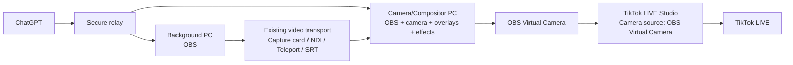

# Phase 2: Dual-PC TikTok LIVE Studio Production

## User case

A creator runs OBS Studio on two computers:

- **Background PC:** produces backgrounds, virtual sets, or other visual media.
- **Camera/Compositor PC:** receives the background feed, adds the creator's camera, overlays, and effects in OBS, and sends the finished video to TikTok LIVE Studio through OBS Virtual Camera.

The creator should be able to pair both computers to one OBS Creator Assistant account and control the combined production from ChatGPT without confusing which computer performs each action.

## Scope

OBS Creator Assistant coordinates OBS on both computers. It does not transport video between them and does not automate TikTok LIVE Studio through simulated mouse clicks or keystrokes.

The creator may use any separately configured transport supported by their setup, such as a capture card, NDI, OBS Teleport, SRT, or another existing OBS source. Phase 2 detects and validates the named source but does not install third-party transport plugins or automatically configure the network video path.

## TikTok LIVE Studio compatibility contract

TikTok LIVE Studio runs on the Camera/Compositor PC and uses **OBS Virtual Camera** as a Camera source. TikTok's official documentation supports selecting connected cameras and confirms that a third-party virtual camera can be selected in LIVE Studio.

OBS Creator Assistant controls the two OBS instances and OBS Virtual Camera. TikTok LIVE Studio remains responsible for:

- The TikTok account and LIVE eligibility.
- LIVE title, topic, cover, audience settings, and moderation.
- The final preview and **Go LIVE** / **End LIVE** actions.
- TikTok scenes, widgets, gifts, chat, co-hosting, and analytics.
- Microphone and other audio-device selection.

OBS Virtual Camera is treated as the video handoff. Audio must be configured and tested separately in TikTok LIVE Studio using the intended microphone or virtual audio device.

Official references:

- [TikTok LIVE Studio: Add a camera source](https://www.tiktok.com/live/studio/help/article/Get-started-with-your-first-LIVE/Add-a-camera-source-to-let-viewers-know-you)
- [TikTok LIVE Studio: Third-party virtual cameras are supported](https://www.tiktok.com/live/studio/help/article/Gaming-Co-host/Gaming-Co-host)
- [TikTok LIVE Studio: Preview video and test audio](https://www.tiktok.com/live/studio/help/article/Get-started-with-your-first-LIVE/Preview-your-video-and-audio?lang=en)
- [OBS Virtual Camera Guide](https://obsproject.com/kb/virtual-camera-guide)

## Proposed production flow

## Creator experience

### One-time setup

1. Pair both OBS computers to the same authenticated account.
2. Give each computer a clear name.
3. Assign the **Background** role to one computer.
4. Assign the **Camera/Compositor** role to the other.
5. Select the background scene on the Background PC.
6. Select the receiving source and composite scene on the Camera PC.
7. Confirm that OBS Virtual Camera is installed and available on the Camera/Compositor PC.
8. In TikTok LIVE Studio, add or edit a Camera source and select **OBS Virtual Camera**.
9. Match the OBS output resolution and frame rate to the intended TikTok LIVE Studio layout.
10. Configure and test the microphone or virtual audio device separately in TikTok LIVE Studio.
11. Save the setup as a reusable TikTok production preset.

### Start production

The creator can say:

> Prepare my dual-PC virtual camera setup.

OBS Creator Assistant will:

1. Confirm that both assigned computers are online.
2. Confirm that OBS is reachable on both computers.
3. Verify the configured scenes and receiving source exist.
4. Capture each computer's current scene and output state for recovery.
5. Switch the Background PC to the selected background scene.
6. Verify that the Camera PC's receiving source is enabled.
7. Switch the Camera PC to the composite scene containing the virtual camera, overlays, and effects.
8. Start OBS Virtual Camera on the Camera/Compositor PC only after an explicit confirmation.
9. Confirm that the virtual camera reports active.
10. Remind the creator to verify the video preview and test audio in TikTok LIVE Studio.
11. Return a readiness summary for both computers and a clear **Ready for TikTok preview** state.

OBS Creator Assistant does not click TikTok's **Go LIVE** button. The creator reviews the TikTok preview and starts the LIVE from TikTok LIVE Studio.

### Change the production

Examples:

- “Change the background PC to Neon City.”
- “Hide the lower-third overlay on the camera PC.”
- “Run the transition on both computers.”
- “Is either OBS computer dropping frames?”
- “Switch the camera setup back to my standard scene.”

Every request targets a role or a named computer. Ambiguous requests require clarification when more than one computer could perform the action.

### Stop production

The creator can say:

> Stop my dual-PC virtual camera setup.

OBS Creator Assistant will:

1. Remind the creator to end the LIVE in TikTok LIVE Studio first if it is still live.
2. Request confirmation before stopping OBS Virtual Camera.
3. Stop OBS Virtual Camera on the Camera/Compositor PC.
4. Restore the previous Camera/Compositor PC scene and affected source states.
5. Restore the previous Background PC scene.
6. Report any step that could not be restored.

## Required Phase 2 capabilities

### Device roles and presets

- Name paired computers.
- Assign a computer a production role.
- Select a default computer for single-device commands.
- Store a dual-PC production preset under the authenticated account.
- Ensure every device in a preset belongs to the same account.

### Virtual camera controls

Add allowlisted tools to:

- Inspect virtual-camera status.
- Start OBS Virtual Camera.
- Stop OBS Virtual Camera.
- Avoid duplicate start or stop actions.
- Require confirmation before remotely stopping an active virtual camera.

### Coordinated multi-computer workflows

Add a relay-level coordinator that:

- Dispatches commands to two explicitly identified devices.
- Runs readiness checks before making changes.
- Supports ordered steps and bounded timeouts.
- Records completed steps per device.
- Restores captured state in reverse order after a failure.
- Never sends a command to an offline, unowned, or unassigned computer.
- Returns a per-device result instead of hiding partial failures.

### Health and readiness

For each computer, report:

- Relay connection status.
- OBS connection status.
- OBS and OBS WebSocket versions.
- Current scene.
- Streaming, recording, replay-buffer, and virtual-camera status.
- CPU, memory, FPS, render lag, and encoding lag.
- Whether the required scenes and sources exist.

### Source validation

On the Camera PC:

- Confirm the configured receiving source exists.
- Confirm it is visible in the selected composite scene.
- Confirm its transform fits the canvas when requested.
- Warn when the source is missing or disabled.
- Do not claim that the underlying video feed is healthy unless a supported signal check is available.

## Proposed API surface

### `obs_save_dual_pc_preset`

Stores:

- Preset name.
- Background device ID and scene name.
- Camera/compositor device ID and scene name.
- Receiving source name.
- Optional overlay and camera source names.
- Final output type, including `tiktok_live_studio_virtual_camera`.
- Expected OBS video resolution and frame rate.
- Acknowledgement that TikTok audio is configured separately.

### `obs_inspect_dual_pc_readiness`

Performs read-only validation and returns a result for each device plus an overall readiness state.

### `obs_start_dual_pc_production`

Runs the ordered startup workflow after confirmation for any live-output action.

### `obs_update_dual_pc_production`

Applies role-specific scene, source, transition, or audio changes while the production is active.

### `obs_stop_dual_pc_production`

Stops the configured output after confirmation and restores captured state where possible.

## Failure behavior

| Failure | Expected behavior |
| --- | --- |
| Either computer is offline before startup | Make no changes and identify the unavailable role. |
| Background PC fails after its scene changes | Restore its prior scene when possible; do not start the Camera PC output. |
| Camera PC receiving source is missing | Do not start Virtual Camera; keep the Background PC safe and restore changed state. |
| OBS Virtual Camera is unavailable | Do not report TikTok readiness; provide the OBS Virtual Camera troubleshooting path. |
| TikTok LIVE Studio does not show OBS Virtual Camera | Keep OBS prepared, but do not claim the setup is ready; instruct the creator to refresh or re-add the Camera source. |
| Video is present but audio is missing | Do not change OBS video routing; direct the creator to the separate TikTok LIVE Studio audio test. |
| Camera PC disconnects during production | Warn immediately; do not issue commands to the wrong or replacement device. |
| A restore step fails | Report the exact device and state requiring manual attention. |
| Relay times out | Mark the result unknown and re-inspect state before retrying. |
| Duplicate start/stop request | Return the existing state without toggling it. |

A distributed transaction across two OBS computers cannot be perfectly atomic. The design therefore uses preflight validation, ordered execution, captured state, idempotent commands, and best-effort compensation.

## Security requirements

- Both computers must be paired to the same authenticated account.
- Device ownership must be checked again for every command.
- Role assignment does not bypass device authorization.
- Remote commands remain allowlisted.
- High-impact output changes require explicit confirmation.
- OBS passwords and local bridge tokens remain on their respective computers.
- The relay stores device identifiers and preset metadata, not OBS credentials.
- Multi-computer actions produce an account-scoped audit record.
- No automatic LAN scanning or cross-device credential sharing.

## Acceptance criteria

Phase 2 supports this user case when:

- A creator can pair, name, and assign roles to two computers.
- A saved preset consistently targets the correct computer for each action.
- A readiness check validates both OBS instances, scenes, and the receiving source.
- One confirmed command prepares the background and composite scenes and starts Virtual Camera on the correct computer.
- Role-specific commands cannot accidentally target the other computer.
- Startup stops safely when either computer or required OBS resource is unavailable.
- The creator receives a per-device result for success, failure, timeout, and restoration.
- Stopping the production restores the prior scene state where possible.
- The video transport remains creator-selectable and independent of the coordination layer.
- TikTok LIVE Studio on the Camera/Compositor PC can select OBS Virtual Camera as its Camera source.
- The readiness result distinguishes **OBS ready** from **Ready for TikTok preview**.
- The creator can verify portrait or landscape framing before going live.
- Audio readiness is tested separately in TikTok LIVE Studio.
- OBS Creator Assistant never claims it started or ended a TikTok LIVE when it only controlled OBS Virtual Camera.

## Trade-offs and future review

- **Transport independence** supports more creator setups but cannot guarantee video-signal health without transport-specific integrations.
- **Sequential coordination** is simpler and safer than pretending two remote OBS instances can change atomically, but changes may briefly occur at different times.
- **Saved role assignments** improve usability but require strong device naming, ownership checks, and recovery when a computer is replaced.
- **Confirmation gates** add one step to live-output controls but reduce accidental interruptions.

Revisit transport-specific health checks, synchronized timing, shared team access, and automated failover after the basic two-computer workflow is proven reliable.
